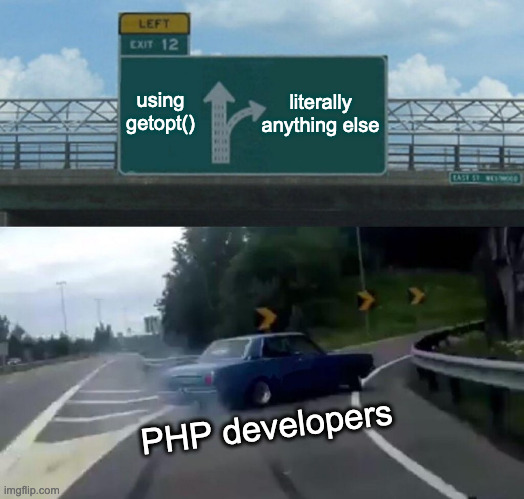

<!-- .slide: class="title-slide" data-hide-footer -->
# Building for the PHP Command Line Interface

Steve Grunwell <!-- .element: class="byline" -->
[@stevegrunwell@phpc.social](https://phpc.social/@stevegrunwell)
[stevegrunwell.com/slides/php-cli](https://stevegrunwell.com/slides/php-cli)

---

## Why the CLI?

Note:

Before we talk about how, let's discuss *why* you might use PHP on the command line

----

### Benefits of the CLI

* <!-- .element: class="fragment" --> Interact with your apps, no GUI required
* <!-- .element: class="fragment" --> Great for setup/maintenance scripts
* <!-- .element: class="fragment" --> Cron jobs & queues

Note:

There are a number of different reasons we might want to interact with our apps from the CLI.

1. No GUI required, super helpful for services, utilities (Composer, PHP_CodeSniffer, PHPUnit, PHPStan, etc.)
2. Useful for setup, maintenance, seeding, etc.
    * Things you wouldn't normally expose a UI for


----

### PHP Everywhere!

* <!-- .element: class="fragment" --> Re-use application code
* <!-- .element: class="fragment" --> Reduce language sprawl

Note:

* The biggest benefit of PHP on the CLI is that we're still working in PHP: no alternate implementations, duplicative services, etc.
* Keeps codebase tighter and prevents every PHP dev on your team from *also* having to write Bash or Python
* PHP is a scripting language at heart

----

### Invoking PHP on the CLI

Via the PHP binary: <!-- .element: class="fragment" data-fragment-index="0" -->

```sh
$ php my-command.php
```
<!-- .element: class="fragment" data-fragment-index="0" -->

With the PHP shebang:<!-- .element: class="fragment" data-fragment-index="1" -->

```sh
#!/usr/bin/env php
```
<!-- .element: class="fragment" data-fragment-index="1" -->

```cli [1|2]
$ chmod +x my-command.php
$ ./my-command.php
```
<!-- .element: class="fragment hide-line-numbers" -->

Note:

Two ways of running PHP scripts on the command line:

1. Explicitly passing the script as an argument to the `php` binrary
2. Using the PHP shebang
    * Probably familiar if you've done shell scripting before
    * Tells the shell how to interpret the script (literally "php from the user's $PATH")

As long as the script has an executable bit in its permissions, we can run it like any other command

----

### When might I use them?

* <!-- .element: class="fragment" --> Data migrations & transformations
* <!-- .element: class="fragment" --> Maintenance scripts
* <!-- .element: class="fragment" --> Dev-only actions
	* Scaffolding
	* Other code changes
* <!-- .element: class="fragment" -->"#YOLO scripts"

Note:

Other code changes like schema updates, table seeding, etc.

YOLO scripts = scripts you're only going to run once (or a small number) of times.

---

## <span class="no-transform">CLIs</span> for your Favorite Frameworks

----

### [Drush](https://www.drush.org)

* <!-- .element: class="fragment" --> "Drupal Shell"
* <!-- .element: class="fragment" --> One of the OG CLI tools for PHP CMSs
* <!-- .element: class="fragment" --> Manage themes, modules, system updates, etc.

Note:

Credit where credit is due, Drush is one of the earliest CLI tools for managing a PHP application

----

### [WP-CLI](https://wp-cli.org)

* <!-- .element: class="fragment" --> Install core, themes, plugins, etc.
* <!-- .element: class="fragment" --> Manage posts, terms, users, and more
* <!-- .element: class="fragment" --> Inspect and maintain cron, caches, and transients
* <!-- .element: class="fragment" --> Extensible for themes + plugins


Note:

Heavily inspired by Drush, WP-CLI lets you perform most operations on a WordPress site without touching the GUI

Before my current job, I spent five years working at a WordPress-oriented web host. We used WP-CLI for *everything*

----

### [Laravel Artisan](https://laravel.com/docs/master/artisan)

* <!-- .element: class="fragment" --> The underlying CLI for Laravel
* <!-- .element: class="fragment" --> Scaffold 
* <!-- .element: class="fragment" --> Built atop the Symfony Console
* <!-- .element: class="fragment" --> Third-party access

Note:

* Easily scaffold models, controllers, console commands, and more!
* Third-party packages can register new commands
    - Easy to build toolkits for Laravel devs

----

### Joomlatools Console

* <!-- .element: class="fragment" --> CLI framework for Joomla
* <!-- .element: class="fragment" --> Manage sites, extensions, databases, & virtual hosts
* <!-- .element: class="fragment" --> List, purge, and clear cache contents

Note:

* Kind of neat: has the "vhost" command for managing Apache + nginx virtual hosts

---

## CLI Concepts

Note:

While it's not any more difficult than building anything else in PHP, there are some concepts that you need to understand if you're going to build for the CLI

----

### Composability

Good CLI commands should be **composable!**

Note:

Composability is one of the major tenents of *nix operating systems.

Who can tell me what this means?

----

### Rule of Composability

> Developers should write programs that can communicate easily with other programs. This rule aims to allow developers to break down projects into small, simple programs rather than overly complex monolithic programs.

<cite>Eric S. Raymond, [*The Art of Unix Programming*](https://en.wikipedia.org/wiki/The_Art_of_Unix_Programming)</cite>

----

### Data Streams

Three default data streams:

0. <!-- .element: class="fragment" --> STDIN - <u>in</u>put
1. <!-- .element: class="fragment" --> STDOUT - <u>out</u>put
2. <!-- .element: class="fragment" --> STDERR - <u>err</u>ors

Note:

Think of a data stream as a channel that can be read from and/or written to.

Generally, there are three data streams to concern yourself with:

1. STDIN represents the data coming into your command
2. STDOUT is where you're sending data out
3. STDERR is where we collect any error information

Streams can be redirected (e.g. write errors to a log file, send the output of one command as the input into another)

----

### Data Streams in Practice

```cli [|2-3|4|5|6|7]
# Get the number of unique IP addresses in access.log
$ sudo grep -Eo "([0-9]{1,3}[\.]){3}[0-9]{1,3}" \
    /var/log/nginx/access.log \
    | uniq \
    | wc -l \
    | xargs printf "%d unique IP addresses detected"
43282 unique IP addresses detected
```
<!-- .element: class="hide-line-numbers" -->

Note:

Counting the number of IP addresses in access.log:

1. Use `grep` to match anything that looks like an IP, returning only that part
    * STDOUT would be a series of IP addresses, one per line
2. Pipe that list of addresses into `uniq` to remove duplicates
    * STDOUT from grep became STDIN to uniq
3. Pipe the filtered list into `wc` (word count) with the `-l` flag (count the number of lines)
    * STDOUT becomes an integer representing the number of lines
4. Use `xargs` to append that number to printf to give a summary

----

### Exit Codes

Exit codes tell us how everything went:

| Code | Meaning |
| --- | --- |
| 0 | All good! |
| 1 | Generic error |
| 2 | Incorrect command/arg usage |
| 3–255 | Specific errors |

Note:

When a command exits, we do so with an exit code.

* 0 means that no errors occurred
* 1 is generally a catch-all for errors
* 2 is typically meant to indicate incorrect command/arg usage
* 3–255 may have special meaning; there are a few conventions in the 120s for permissions errors
    * You might use 3 for validation issues, 4 for network connectivity issues, etc.

Most scripts you come across will generally use 0 or 1: did it succeed or fail (respectively)?

----

### Exit Codes & Boolean Operators

```cli [1-2|4-5|7-8|10-11]
# Celebrate a non-zero exit code!
$ do-something && celebrate

# Hang your head in shame if something fails
$ do-something || hang-head-in-shame

# Put the operators together
$ (do-something && celebrate) || hang-head-in-shame

# Semi-colons don't care, they just separate commands
$ do-something; celebrate; hang-head-in-shame
```
<!-- .element: class="hide-line-numbers" -->

Note:

We can chain operations based on the exit code of the previous command:

* Double-ampersand ("and") will proceed if the previous operation had an exit code of zero
* Double pipes ("or") will proceed if we encountered a non-zero exit code
* Both can be used, but use parentheses if you want the "or" to be tied to the "and" sequence

----

### A final note on Exit Codes

The last exit code provided will be used

<pre class="hljs"><code class="hljs lang-sh">#!/usr/bin/env bash

if grep -i woof cat-sounds.txt; then
    echo 'Congrats, your cat goes "woof"!'
    exit 0
fi

echo "Cats don't woof, you silly goose!"</code><code class="hljs lang-sh fragment" data-fragment-index="1" style="position: static; margin-top: -1em; padding-top: 0;">exit 1</code></pre>

<pre class="fragment-replace fragment" data-fragment-index="0"><code class="fragment fade-out hljs lang-cli" data-fragment-index="1">$ ./what-does-the-cat-say; echo $?
Cats don't woof, you silly goose!
0</code><code class="fragment hljs lang-cli" data-fragment-index="1">$ ./what-does-the-cat-say; echo $?
Cats don't woof, you silly goose!
1</code></pre>

Note:

If you don't specify an exit code, the last one that occurred will be used.

This can cause issues if you use things like "echo" (which will almost certainly exit with 0) for error messages but don't explicitly exit.

When you're exiting—especially for an error condition—make sure you're calling exit with an appropriate exit code!

----

### Arguments + Options

```cli [1-3|5-8|10–12]
# Arguments
$ cd /var/www
$ grep "Some text" file.txt

# Options
$ git commit -m "This is my commit message"
$ ls -a -l
$ ls -al

# Long options
$ composer outdated --format=json
$ git push --force-with-lease
```
<!-- .element: class="hide-line-numbers" -->

Note:

* Arguments: positional parameters, passed in order
* Options: Can contain values, single dash + single letter. Can usually be combined
* Long options: Can contain values, two dashes + multiple letters

----

### Conventions for Options

```plaintext
OPTIONS:

  -h|--help     Print usage instructions
  -q|--quiet    Silence all output
  -v|--version  Print version information
  --verbose     Print additional output
```

Note:

While these aren't mandatory, there are a few common patterns you'll come across:

* Many scripts will reserve `-h` and/or `--help` for displaying usage instructions
* `-q` or `--quiet` is generally used to silence output
    * Especially useful for commands that may be run on a cron job, where you only want output if something goes wrong
* `-v` has two common uses: either as a short-hand for version or verbose (print additional information)

Notice that most of these options have both short and long versions!

----

### Environment Variables

Set and read variables in the current environment

```cli [1-2|4-5|7-8]
# Export from shell files
export CURRENT_CITY="Bowling Green"

# Set directly in shell
$ CURRENT_CITY="Chicago"

# Set as you call a command
$ CURRENT_CITY="Rosemont" some-script
```
<!-- .element: class="hide-line-numbers" -->

Note:

There are three ways to set environment variables:

1. Export them from within a file like `.bash_profile`, which is sourced as your start your shell
    * Persists for all sessions
2. Explicitly set the variable in the shell
    * Persists for remainder of session
3. Set them as you're calling a command
    * Only set for the single command invocation

If I set it all three of these ways, what would some-script get for the value of CURRENT_CITY? (Rosemont)

----

### Environment Variables in PHP

```php [1-2|4-5|7-8|10-11]
# Get array of all environment variables
getenv();

# Retrieve a specific variable (false if unset)
getenv('SOMEVAR');

# Set an environment variable
putenv('SOMEVAR=some_value');

# Delete an environment variable
putenv('SOMEVAR=');
```
<!-- .element: class="hide-line-numbers" -->

Note:

There are two primary functions for working with environment variables in PHP:

1. `getenv()` reads from the environment variables
2. `putenv()` writes to the environment variables

There's also the `$_ENV` superglobal, but writing to this array has no impact on the environment.

----

### The cli SAPI

Additional **S**erver **API** for PHP

```php
// Don't run unless we're on the CLI.
if (php_sapi_name() !== 'cli') {
    exit;
}
```

Note:

* PHP has a number of server APIs that can introduce alternate functionality; cli is one of them
* Other SAPIs include apache, cgi-fcgi, fpm-fcgi, litespeed, phpdbg, etc.
* We can determine what SAPI we're using with the `php_sapi_name()` function or `PHP_SAPI` constant. For console commands, we should prevent anything from running

----

### Special CLI globals

<dl>
    <dt class="fragment" data-fragment-index="0"><code><span class="typehint">int</span> $argc</code></dt>
    <dd class="fragment" data-fragment-index="0">Argument <u>c</u>ount</dd>
    <dt class="fragment" data-fragment-index="1"><code><span class="typehint">array</span> $argv</code></dt>
    <dd class="fragment" data-fragment-index="1">Argument <u>v</u>alues</dd>
</dl>

Both will always have at least one value! <!-- .element: class="fragment" -->

Note:

The CLI SAPI exposes two CLI-specific global variables: $argc and $argv.

* $argc tells us the number of arguments passed to the script
* $argv is an array of those values

These will never be empty, because the script name is the first argument.

----

```cli
$ php -r 'echo "{$argc} arg(s):\n"; var_export($argv);' \
    PHP "is great"
```

```
3 arg(s):
array (
  0 => 'Standard input code',
  1 => 'PHP',
  2 => 'is great',
)
```
<!-- .element: class="fragment" -->

Note:

To demonstrate $argc and $argv, let's pass a simple script to the CLI PHP interpreter:

Can anyone guess the values of $argc and $argv?

----

### Daemons

A process that continually runs in the background

```php
while (true) {
    // do something!
}
```

<figure class="fragment beardhawk">
    
    <figcaption><a href="https://prezi.com/0l3a7q5dywc6/building-php-daemons-and-long-running-processes">Building PHP Daemons and<wbr> Long Running Processes</a></figcaption>
</figure>

Note:

* Not the best use of PHP, but useful for things like workers
* Talk that really got me into PHP CLI: Building PHP Daemons and Long Running Processes by Tim Lytle
    - php[tek] 2015

---

## Writing CLI Commands

Note:

Now that we have a foundation, let's get into writing our own commands!

----

### A simple greeter

```php [|1|4|6]
#!/usr/bin/env php
<?php

$name = $argv[1] ?? 'there';

printf("Hello, %s!\n", $name);
```
<!-- .element: class="hide-line-numbers" -->

Note:

Let's start with a bare-bones greeter script.

We'll grab the first argument passed, but if we don't have one we'll fall back to "there".

----

```cli
$ php hello.php Ben
Hello, Ben!
```

```cli
$ php hello.php
Hello, there!
```
<!-- .element: class="fragment" -->

Note:

In practice, our script works like this:

Calling the script with "Ben" as an argument makes it say "Hello, Ben!"

No argument means it falls back to "Hello, there!"

----

### Accepting Options

```php [|8-10|11|12|14]
#!/usr/bin/env php
#
# USAGE:
#
#     hello.php [-g|--greeting=<greeting>] <name>
<?php

$opts = getopt('g:', [
    'greeting:',
], $index);
$greeting = $opts['greeting'] ?? $opts['g'] ?? 'Hello';
$name = $argv[$index] ?? 'there';

printf("%s, %s!\n", $greeting, $name);
```
<!-- .element: class="hide-line-numbers" -->

Note:

Let's take our script from earlier and let a custom greeting be passed via either `-g` or `--greeting`

With `getopt()`, we're saying that "g", when present, must have a value.

We'll use `getopt()`, specifying "g" as an option and "greeting" as a long option. We'll store the value in `$greeting`, falling back to "Hello"

----

```cli
$ php hello.php --greeting=Salutations Dylan
Salutations, Dylan!
```

```cli
$ php hello.php -g=Salutations Dylan
Salutations, Dylan!
```
<!-- .element: class="fragment" -->

Note:

Running the new version, we can pass `--greeting` or `-g` with an equal sign. If both are present, we'll favor `--greeting`

However, the format can be rather restrictive:

* All options must come before arguments
* Messing up the $rest_index (third arg of `getopt()`, set by reference) means that option keys can easily slip in as values
* No validation, so you have to handle that yourself

----

### We can do better than `getopt()`!



Note:

Honestly, `getopt()` is a pain to work with and, as a result, a pain to use scripts that use it.

In a minute, we'll take a look at some libraries and frameworks we can use to make handling all of these things easier

----

### Performing system operations

<ul>
    <li class="fragment">
        PHP has built-in functions for things like <a href="https://www.php.net/manual/en/function.chmod.php"><code>chmod()</code></a>, <a href="https://www.php.net/manual/en/function.mkdir.php"><code>mkdir()</code></a>, etc.
        <ul>
            <li>Even more with <a href="https://flysystem.thephpleague.com">Flysystem</a></li>
        </ul>
    </li>
    <li class="fragment">Can also execute arbitrary system commands!</li>
</ul>

Note:

When writing CLI scripts, it's not uncommon to need to do something on the filesystem.

Remember that PHP has built-in functions for a lot of these operations, and you can get even more by leveraging a package like Flysystem

----

### Calling other scripts

<dl>
    <dt class="fragment" data-fragment-index="0"><a href="https://www.php.net/manual/en/function.exec.php"><code>exec()</code></a><dt>
    <dd class="fragment" data-fragment-index="0">Execute, return the <u>last line</u> of output</dd>
    <dd class="fragment" data-fragment-index="0">Can capture full output as array, exit code</dd>
    <dt class="fragment" data-fragment-index="1"><a href="https://www.php.net/manual/en/function.shell-exec.php"><code>shell_exec()</code></a></dt>
    <dd class="fragment" data-fragment-index="1">Execute, return the <u>full output</u> as string</dd>
</dl>

Note:

The most common ways you'll see PHP call other scripts

* `exec()` is a bit more flexible, as we can populate the full output and exit code by reference
* `shell_exec()` will return the full output as a string, and is the same as wrapping the command in backticks

----

### Calling other scripts

<dl>
    <dt><a href="https://www.php.net/manual/en/function.system.php"><code>system()</code></a></dt>
    <dd>Returns last line of output, flushes buffer as it goes</dd>
    <dt><a href="https://www.php.net/manual/en/function.passthru.php"><code>passthru()</code></a></dt>
    <dd>Best choice for binary files</dd>
</dl>

Note:

* `system()`
    * Works the same as its C equivalent
    * Will attempt to flush the output buffer as it goes, but only returns the last line (and can set exit code to a variable by reference)
* `passthru()` doesn't attempt to transform the output, so this is really useful when working within binary files like images, video, etc.
    * Link in slides' README explaining how I used it to generate animated thumbnails for gifs

----

<!-- .slide: data-background-image="resources/spidey-sense.png" data-background-position="left bottom" data-background-size="contain" data-hide-footer -->

Note:

If the thought of executing arbitrary system commands sets off your security sense, you're 100% correct.

Let's talk about how we can properly escape commands and arguments.

----

### Escaping commands & arguments

<dl>
    <dt class="fragment" data-fragment-index="0"><a href="https://php.net/manual/en/function.escapeshellcmd.php"><code>escapeshellcmd()</code></a></dt>
    <dd class="fragment" data-fragment-index="0">Escape an entire command</dd>
    <dt class="fragment" data-fragment-index="1"><a href="https://php.net/manual/en/function.escapeshellarg.php"><code>escapeshellarg()</code></a></dt>
    <dd class="fragment" data-fragment-index="1">Escape an individual argument</dd>
</dl>

Note:

There are two major functions you should be aware with:

1. `escapeshellcmd()` escapes any meta-characters that could be used to chain other commands
2. `escapeshellarg()` escapes individual arguments and options and should *always* be used with user data

----

### Without escaping

```php
$name = 'Larry && rm -rf /';

# Uh oh, $name isn't being escaped!
exec('greet-user ' . $name);
```

```text
# You're about to have a very bad day...
Hello, Larry!
```
<!-- .element: class="fragment" -->

Note:

Imagine we have a greet-user script, which accepts a name and spits out "Hello, $name!"

Now, let's say the `$name` variable is coming from an untrusted source, like $_POST data: simply passing it means that a well-crafted name could execute arbitrary commands on our system 😬

----

### With proper escaping

```php
$name = 'Larry && rm -rf /';

# Escape the argument with escapeshellarg()
exec('greet-user ' . escapeshellarg($name));
```

```text
# Weird name, but no harm done
Hello, Larry && rm -rf /!
```
<!-- .element: class="fragment" -->

Note:

In this version, the `$name` is properly-escaped so that it can't tack on another command.

---

## Libraries & Frameworks

Note:

With many of those fundamentals out of the way, we can start looking at some of the available libraries and frameworks to make writing PHP for the CLI way nicer

----

### [Symfony Console](https://symfony.com/doc/current/components/console.html)

* <!-- .element: class="fragment" --> CLI framework of choice
* <!-- .element: class="fragment" --> Handlers for input & output
* <!-- .element: class="fragment" --> Born to be tested

Note:

* Component from the Symfony framework
* De facto tool for writing PHP CLI scripts
    - Powers Artisan, Composer, Behat, and more
* Ships with methods for all sorts of input and output handling
* Designed from the ground-up to be easily tested
* Easily integrates with other Symfony components

----

#### Building a Symfony Console Command

```php [|1|3-4|6|7-9]
namespace App\Command;

use Symfony\Component\Console\Attribute\AsCommand;
use Symfony\Component\Console\Command\Command;

#[AsCommand(name: 'app:create-user')]
class CreateUserCommand extends Command
{
    // ...
```
<!-- .element: class="hide-line-numbers" -->

Note:

Each Symfony Console command is its own class, which extends `Symfony\Component\Console\Command\Command`

1. First, define our namespace (we'll just use `App\Command`)
2. Pull in the AsCommand attribute and the base Command class from Symfony Console
3. Set the command name (app:create-user)
4. Construct the class, extending that base Command

----

#### The execute() method

```php [1-7,11|8|10]
use Symfony\Component\Console\Input\InputInterface;
use Symfony\Component\Console\Output\OutputInterface;

protected function execute(
    InputInterface $input,
    OutputInterface $output
): int {
    // Do something in here!

    return Command::SUCCESS;
}
```
<!-- .element: class="hide-line-numbers" -->

Note:

The main entry point for your command is the `execute()` method.

It receives an implementation of the `InputInterface` (for reading from STDIN) and `OutputInterface` (for writing to STDOUT and STDERR), and will return an exit code (`Command::SUCCESS` is 0, `Command::ERROR` is 1, `Command::INVALID` is 2)

----

#### Configuring the command

```php
protected function configure(): void
{
    $this->setDescription('Creates a new user.')
        ->setHelp(/* Full help text goes here... */)
        ->addArgument(/* ... */)
        ->addOption(/* ... */);
}
```

Note:

The configure() method lets us set things like the description, help text, and define any arguments and/or options our command might take.

Inputs can be specified as required or optional, be configured to support multiple values, and even given defaults.

----

#### Arguments + options

```php
$user = new User($input->getArgument('email'));

if ($input->getOption('admin')) {
    $user->makeAdmin();
}

$user->save();
```

Note:

Using the argument and option we defined in `configure()`, we can now access those values via `getArgument()` and `getOption()` on our `InputInterface` instance

----

#### Bootstrap our command(s)

```php
#!/usr/bin/env php
<?php

require __DIR__ . '/vendor/autoload.php';

use App\Command\CreateUserCommand;
use Symfony\Component\Console\Application;

$app = new Application();
$app->add(CreateUserCommand());
$app->run();
```

Note:

A Symfony command by itself doesn't do much, it needs to be registered within a Symfony console application.

You can think of this like a video game console: the app is our Nintendo/Xbox/Playstation, while each command is a game in our library.

This is essentially what the main Composer and Artisan files look like: they define the console application and determine where commands are read from.

----

#### Calling our command

```cli [1|3-4|6-7]
$ php console.php app:create-user beth@example.com --admin

# If we've made console.php executable
$ console.php app:create-user andy@example.com

# Produce the help documentation
$ console.php app:create-user --help
```
<!-- .element: class="hide-line-numbers" -->

Note:

Assuming we've named our bootstrap file "console.php", we can now call our new command in a few ways:

1. We can pass the filename to the PHP binary, and create a User for Beth with admin privileges
2. If we've made console.php executable, we can just call console.php directly
3. We can add the `--help` option, which will automatically generate help docs for us

----

### [PHP-CLI Tools](https://github.com/wp-cli/php-cli-tools)

* <!-- .element: class="fragment" --> Simplify input + output
    - <!-- .element: class="fragment" --> Tabular + tree displays
    - <!-- .element: class="fragment" --> Progress indicators
* <!-- .element: class="fragment" --> Maintained by the WP-CLI team

Note:

* Library that simplifies input + output
    - Prompts, menus, arguments
    - Output formatting
    - Tabular + tree displays
    - Progress indicators

----

#### PHP-CLI Tools

```php [|6-9|10-12]
#!/usr/bin/env php
<?php

require_once __DIR__ . '/vendor/autoload.php';

$limit  = cli\prompt('How high should I count?', 10);
$loud   = cli\choose('Shall I shout it');
$suffix = 'y' === $loud ? '!' : '.';

for ($i = 1; $i <= $limit; $i++) {
	cli\line($i . $suffix);
}
```
<!-- .element: class="hide-line-numbers" -->

Note:

Here's another sample program, this time using the PHP CLI Tools library maintained by the WP-CLI team.

Ask how high we should count (with a default of 10) and get a yes/no prompt for volume.

Then we run a simple for-loop until we reach the limit the user provided.

----

####  PHP-CLI Tools

<pre class="hljs lang-cli"><code>$ php Counter.php</code>
<code class="fragment">How high should I count? [10]: 5</code>
<code class="fragment">Shall I shout it? [y/N]y</code>
<code class="fragment">1!
2!
3!
4!
5!</code></pre>

----

### [CLImate](https://climate.thephpleague.com/) <!-- .element: style="text-transform: none;" -->

* More focused on output <!-- .element: class="fragment" -->
    - Progress bars, borders, JSON, and more
* <!-- .element: class="fragment" --> Includes helpers for ASCII art and animations!
 <!-- .element: class="seamless" -->

Note:

* Maintained by The League of Extraordinary Packages
* More output options than PHP CLI Tools
    - Includes some experimental inputs, including radio buttons and check-boxes


---


## CLI Best Practices

Note:

As we wrap up, I'd like to share a few pieces of advice as you enter the world of building for the PHP CLI

----

### Check Your Assumptions

* <!-- .element: class="fragment" --> Check that commands exist before using them
* <!-- .element: class="fragment" --> Don't hard-code system paths

Note:

Everybody's machine is different, and you don't want your script to fail because someone has a different implementation of grep.

If you remember from the shebang, we use `/usr/bin/env` to get the path to the PHP binary from the environment. Even on the same platform, different versions or installation methods may install to different spots.

----

### Rule of Silence

> Developers should design programs so that they do not print unnecessary output. This rule aims to allow other programs and developers to pick out the information they need from a program's output without having to parse verbosity.

<cite>Eric S. Raymond, [*The Art of Unix Programming*](https://en.wikipedia.org/wiki/The_Art_of_Unix_Programming)</cite>

Note:

The amount of output will vary depending on the purpose of your script; a major platform migration might call for very detailed output, while a maintenance script may only need to print something if there was an error.

Some scripts give little to no feedback, while others just barf all over the console. The trick is to get your default output level _just right_.

----

```cli [1-3|5-6|8-12]
# Default behavior
$ some-command
Command completed successfully!

# Only produce output if something went wrong
$ some-command --quiet

# Be more verbose
$ some-command --verbose
Reindexing database...OK
Reticulating splines...OK
Command completed successfully!
```
<!-- .element: class="hide-line-numbers" -->

Note:

Know your audience, and only print the bare minimum by default. Use options like --verbose for when users need more.

----

### Garbage Collection

* <!-- .element: class="fragment" --> Clean up objects when you're done
* <!-- .element: class="fragment" --> Be judicious with caching
* <!-- .element: class="fragment" --> Watch for ballooning objects & arrays!

Note:

* Garbage collector frees up memory that was previously allocated but no longer needed.
* PHP normally handles this automatically @ end of request
* Help the garbage collector by explicitly unsetting variables
* Cache in variables when appropriate, but be aware the size can balloon

----

### Don't let scripts be run from a browser!

If your commands live within the web root, prevent them from being run outside the CLI:

```php
// Prevent this script from being run outside of a CLI context
if (PHP_SAPI !== 'cli') {
    exit;
}
```

Note:

Modern frameworks keep most app code out of the web root, but if you're writing commands that will live under the web root **be sure that they can't be executed by a web request!**

----

### Swanson on Commands


Note:

A common mistake is trying to build a single CLI command that can do it all.

Remember composability: build small, single-purpose commands and then compose sophisiticated pipelines

---

<!-- .slide: data-hide-footer -->

## Thank You!

Steve Grunwell<br>
<span style="font-size: .75em;">Staff Software Engineer, Mailchimp</span>

[stevegrunwell.com/slides/php-cli](https://stevegrunwell.com/slides/php-cli)<!-- .element: class="slides-link" -->
